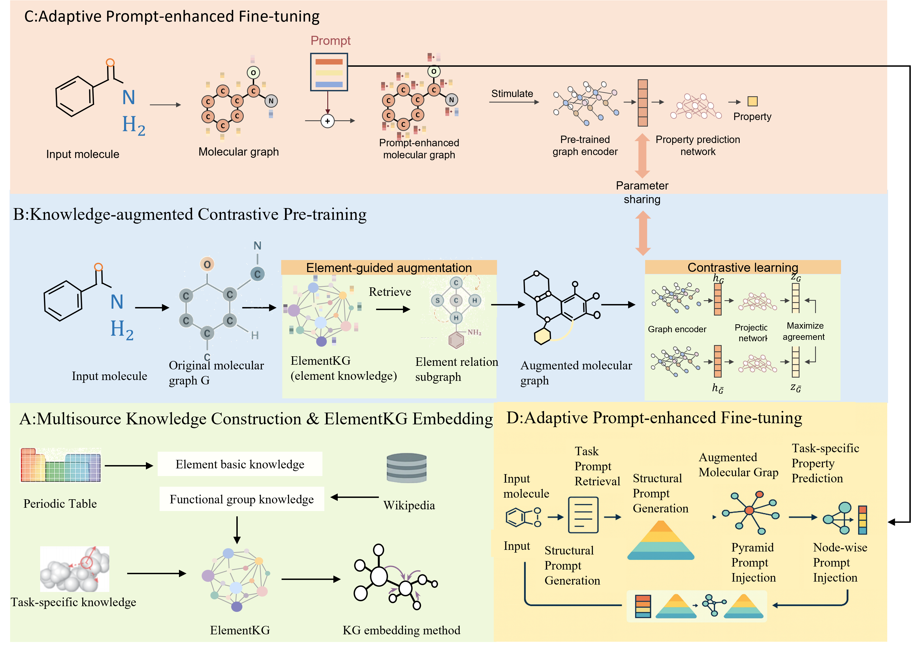

## Overview

KAPT (Knowledge-Enhanced and Adaptive Prompt-Tuning) is a framework designed to enhance molecular representation learning by incorporating structured chemical knowledge and adaptive prompt mechanisms. 
The figure above presents an overview of the KAPT framework and its key components.

This repository hosts the dataset and visual materials related to KAPT. 
Model implementations and full training pipelines are currently under preparation and will be made available in subsequent releases.
